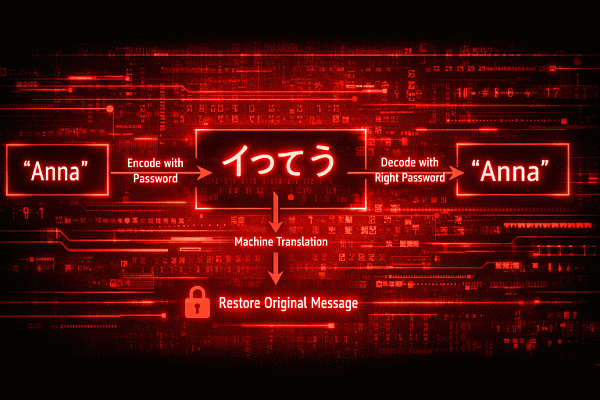
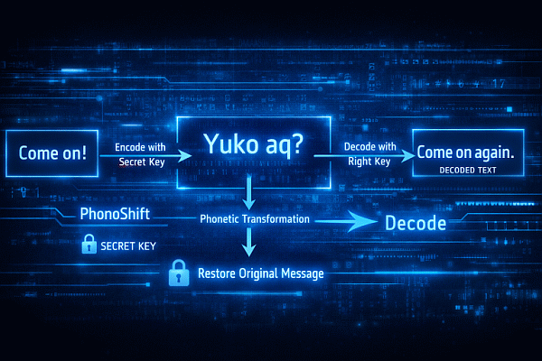

**This is a Rust port of KanaShift and PhonoShift - hardened text transmutation engines.**

# KanaShift & PhonoShift

**Reversible, password-bound text masking with a Japanese visual skin.  
Looks Japanese. Means something else. Decodes back to the truth.**

## Overview

KanaShift and its sibling **PhonoShift (ROT500K)** use a **PBKDF2-derived keystream (500,000 iterations by default)** to make every password guess deliberately expensive.

This is not ROT13 repeated.  
It is a keyed design where reversal without the secret requires paying a real computational cost.

KanaShift applies the same hardened mechanics with kana and kanji, preserving structure and token boundaries while transforming the visible surface into Japanese-looking text. Modern variants include a per-message nonce (with a masked header) to safely reuse passwords across messages.

For performance-sensitive use, prefer release builds—debug compilation can significantly affect runtime.

## Live Demos

----

### Example Outputs with Default Settings — “Rio”

| Family  | Scheme        | Input | Output                                                                 |
|---------|---------------|-------|------------------------------------------------------------------------|
| Kana    | KAN500K2      | Rio   | まによわやるんチえひふみけちなタひケんきセえお           |
| Kana    | KAN500K2T     | Rio   | セをはむたコはちぬクスすとケちめセとウエソおえな           |
| Kana JP | KAN500K2JP    | リオ  | てらをならよむぬすきをかくるはイうきのるブダ               |
| Kana JP | KAN500K2JPT   | リオ  | んれタすとはかふつるまみおうひつかうしさクゲす               |
| Phono   | ROT500K2      | Rio   | Curcuscur dur'bel culpin; ken-leskon; pas canjol hal jon kan; kus; Vae   |
| Phono   | ROT500K2T     | Rio   | Karker kasnar hus'mir bel'cus mon-pen leshes'con gun-merfun jol mer; bon — Beuk |
| Phono   | ROT500K2P     | Rio   | Nen-ninnes — mon fel. mol'nes., lanker jer der honmes ken-dolhes kaldelmer Soyobu Rerofo? Kee |              |

Verified variants (KT, KJPT, KP) append additional characters to enable detection of incorrect passwords during decoding.

The output looks like Japanese text, even though its meaning is hidden.
For example, “Anna” may encode to イつてう, which Google Translate renders as “It’s good”, while only the correct password recovers the original.
Latin text becomes Japanese-looking, and Japanese text remains Japanese-looking but unreadable to native speakers.

The salt value (e.g. `NameFPE:v1`) acts as a domain and version separator rather than a per-message secret, ensuring keystreams are bound to this specific algorithm and version.

---

## Version Note — ROT500K2 / KAN500K2 (V2)

> This project uses a V2 generation format (`ROT500K2`, `KAN500K2`, and variants).  
> Earlier `ROT500K / KAN500K` formats are considered legacy.

### What’s new in V2

- **Per-message nonce**  
  Prevents keystream reuse across messages encrypted with the same password.

- **PBKDF2-derived HMAC keys (verified modes)**  
  Verification no longer uses a fast HMAC directly on the password, preventing oracle attacks that bypass PBKDF2 cost.

- **Stealth framing**  
  No fixed headers, colons, or magic strings.  
  Mode and nonce are encoded as pronounceable, human-looking text.

- **Strict decoding by default**  
  Verified modes require an exact `ROT500K2 / KAN500K2` frame; base modes allow tolerant frame detection.

> Recommendation: use `ROT500K2 / KAN500K2` for all new data.

### Acknowledgment

Thanks to **Sea-Cardiologist-954** for identifying a critical weakness in v1. KAN500K2 / ROT500K2 addresses keystream-reuse attacks present in v1 by introducing a per-message random nonce that is mixed into PBKDF2 salt derivation. As a result, chosen-plaintext or known-plaintext observations from one message do not apply to any other message encrypted with the same password.

---

## What This Is (and Is Not)

KanaShift is **not conventional encryption**. It is a reversible, password-based text masking scheme focused on **structure preservation, visual disguise, and recoverability**.

It is designed for human-readable, structured text—not for providing semantic security over arbitrary natural language.

---

## Performance & Security

A **PBKDF2-derived keystream** imposes a real cost per password guess (500K iterations by default), tuned for short, interactive text.
The iteration count is configurable and can be lowered for batch use, trading brute-force resistance for throughput.

KanaShift uses standard cryptographic primitives, but intentionally keeps output readable and structured.
Its security comes from **computational cost and public scrutiny**, not from obscurity or opaque ciphertext.

---

## Shared Core

- Keyed and reversible (`password + salt + iterations`)
- Payload-level format preservation (keeps `space`, `-`, `'`)
- Class-preserving rotations (no cross-class mapping, no zero-shifts)
- PBKDF2-HMAC-SHA256–derived keystream
- Per-message nonce to prevent keystream reuse (masked header)
- Optional verification variants (decode can return **OK / FAILED**)

---

## PhonoShift (ROT500K)

- Stays in Latin / ASCII
- Phonetic rotation
  - vowels rotate within vowels
  - consonants rotate within consonants
  - case preserved
- Digits stay digits
- Optional punctuation swapping (role-sets, position-preserving)

**Modes:**  
`ROT500K` (base), `ROT500KT` (token-verified), `ROT500KP` (prefix-verified), `ROT500KV` (auto)

---

## KanaShift (KAN500K)

- Switches to Japanese scripts for visual disguise

**Families**
- **Skin (Latin → Kana)**  
  lowercase → hiragana, uppercase → katakana, digits → fullwidth
- **JP-native (JP → JP)**  
  kana stay kana, kanji stay kanji-like; embedded ASCII also obfuscated

**Modes:**  
`KAN500K2`, `KAN500K2T`, `KAN500K2JP`, `KAN500K2JPT`

---

## Key Differences

| Aspect         | PhonoShift (ROT500K) | KanaShift (KAN500K) |
|----------------|----------------------|----------------------|
| Visual script  | Latin / ASCII        | Japanese (kana/kanji) |
| Main goal     | Subtle scrambling    | Visual disguise      |
| Case handling | Upper/lower preserved | Uppercase via katakana |
| Digits        | ASCII digits 0–9     | Fullwidth digits ０–９ |
| JP support    | No                   | Yes                  |
| Best use      | IDs, logs, UI text   | JP text, strong masking |

---

## Usage

- **Browser:** open the HTML file in `src/` or use the hosted GitHub Pages link.
- **Rust:** build with `cargo build -p kanashift_app --release` and run the binary from `target/release/`.
- **Python:** install Gradio (`pip install gradio`) and run `python kanashift_app.py`.

### Quick Pick

- Stay Latin → PhonoShift / ROT500K2
- Need verification → ROT500K2V
- Want strong visual disguise → KanaShift
- Mixed JP + EN text → KAN500K2JP

---
Authored by the cybersecurity professional and programmer Felipe Daragon, with AI assistance.
This project is experimental, not production-ready, and is shared for learning, testing, and review.
This code has not been formally audited and should not be considered cryptographically bulletproof.
Independent review by cryptography experts is encouraged.

Released under the **a 3-clause BSD license** for research and experimental use - see the LICENSE file for details.